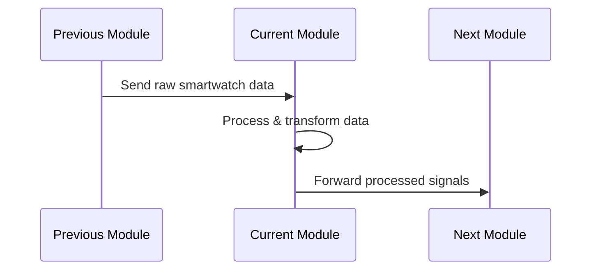

# Module: [Module Name]

## 1. Overview
- **Purpose:**  
  Describe the primary function of this module and its role in the overall stress detection system.

- **Scope:**  
  Briefly outline what problems the module solves and how it contributes to the end-to-end workflow.

- **Key Innovations:**  
  Highlight any unique approaches or optimizations introduced in this module.

---
you should give me the result in markdown format only.

## 2. Context & Integration
- **Position in Project:**  
  Explain how this module fits within the larger system.  
  _Example:_ "This module processes raw data from smart watches and passes the cleaned signals to the signal processing module."

- **Inter-Module Dependencies:**  
  List modules or files that this module interacts with or depends on.  
  _Example:_  
  - Depends on `data_loading` for raw data ingestion.  
  - Feeds into `data_preparation` and `signal_processing`.

- **Workflow Diagram:**  
  (Insert a flowchart/diagram that illustrates the module’s internal workflow and its connections with other modules.)  
  _Placeholder: Insert diagram here (e.g., using Mermaid )._

---
you should give me the result in markdown format only.

## 3. Module Architecture & File Breakdown
- **Directory Structure Overview:**  
  Provide a snapshot of the module’s file organization.  
  _Example:_  
├── data_preparation/ │ ├── init.py │ ├── base_preparer.py │ ├── motion_simulator.py │ └── pipeline.py


- **File Descriptions:**  
File Inventory

File	Type	Responsibility	Research Significance
file1.py	Core/Support	[Single-sentence description]	[Connection to paper findings]
file2.py	Utility	...	...

- **Inter-File Relationships:**  
Describe how these files interact. For example:  
_"The `pipeline.py` imports functions from both `motion_simulator.py` and `noise_simulator.py` to form a composite data preparation pipeline."_

use Dependency Matrix
File	Internal Dependencies	External Dependencies	Research Dependencies
file1.py	file2.py	src/previous_module/fileX.py	[Cited paper/algorithm]

-----
you should give me the result in markdown format only.

## 4. Scientific Implementation
- **Core Algorithms & Code Snippets**
```python
def critical_function(params):
    """
    [Brief mathematical explanation or algorithm rationale with research context]
    
    Parameters:
        params (Type): Description with constraints and expected input.

    Returns:
        result (Type): Description and its significance in the analysis.
    """
    # Key operations with inline commentary
    processed = perform_calculation(params)
    return processed

```

- **Data Flow Pipeline**

you should give me the result in markdown format only.

## 5. Detailed Component Documentation
For each significant component (class, function, or method), include:

### 5.1 [Component Name]
(this can be lengthy as required but should be clear to understand properly)
- **Purpose:**  
Explain what this component is responsible for.

- **Usage Example:**  
```python
# Example usage
instance = ComponentName(param1, param2)
result = instance.perform_action(data)
```
Parameters & Returns:
Parameter	Type	Description
param1	Type	Brief description.
param2	Type	Brief description.
Returns	Type	Description
result	Type	What the output represents.

Internal Workflow:
Describe the sequence of operations inside the component.
"The function first validates input data, then applies [specific algorithm], and finally returns the processed data."

Dependencies:
List any external libraries, modules, or functions that this component relies on.

you should give me the result in markdown format only.

## 6. Error Handling & Logging

Error Strategies:
Detail how exceptions are caught and handled.
"The module raises custom exceptions (e.g., DataValidationError) for any anomalies in data format."
Logging Practices:
Outline how logs are generated and managed.
"All key actions are logged using Python’s logging module with DEBUG level details for troubleshooting."

you should give me the result in markdown format only.

## 7.Research-Grade Documentation
**Key Functions** (Publication Ready)
function_name()

Mathematical Foundation: [Include relevant equations or algorithm references]
Parameters & Returns:
Parameter	Type	Constraints/Research Justification
param1	Type	[Explanation]
| Return | Type | [Outcome significance] |
Performance Complexity: e.g., O(n)
Validation Strategy: [How function outputs are benchmarked]


you should give me the result in markdown format only.

## 8. Experimental Configuration
tabulr :

Parameter	Recommended Value	Experimental Range	Data Source	Reference
sampling_rate	100Hz	50-200Hz	[Dataset Name]	Smith et al. 2020

you should give me the result in markdown format only.

## 9.Research Artifacts

Intermediate Outputs
- Formats: [HDF5/CSV/JSON]
- Metadata Standards: [Details on data annotations and versioning]
- Example Structure:
{
  "timestamp": "ISO8601",
  "biometric_data": {
    "hr": 72.0,
    "eda": 0.35
  },
  "quality_metrics": {}
}


- Validation Metrics
Primary Metrics: Accuracy, Sensitivity, Specificity
Secondary Metrics: Computational Efficiency, Runtime Analysis
Benchmark Comparison: [Short note on improvements over baseline methods]


- Experimental Constraints
Data Limitations: [E.g., sample size, sensor noise]
Temporal Constraints: [Real-time processing limits]
Hardware Dependencies: [Specific smartwatch models, sensor specifications]

you should give me the result in markdown format only.

## 10. Publication Support

10.1 Methodology References
[Paper Citation] – Influenced the algorithm design.
[Algorithm Reference] – Adapted for the smartwatch context

10.2 Result Generation Path
flowchart LR
    A[Raw Data] --> B[Current Module]
    B --> C[Analysis Notebook]
    C --> D[Publication Figure]

you should give me the result in markdown format only.


Search in web for some other related works that suits well with the code. that might include choice taken or the constant value considered.

Also please get the url to that paper and mention it with respect to every paper mentioned by you.