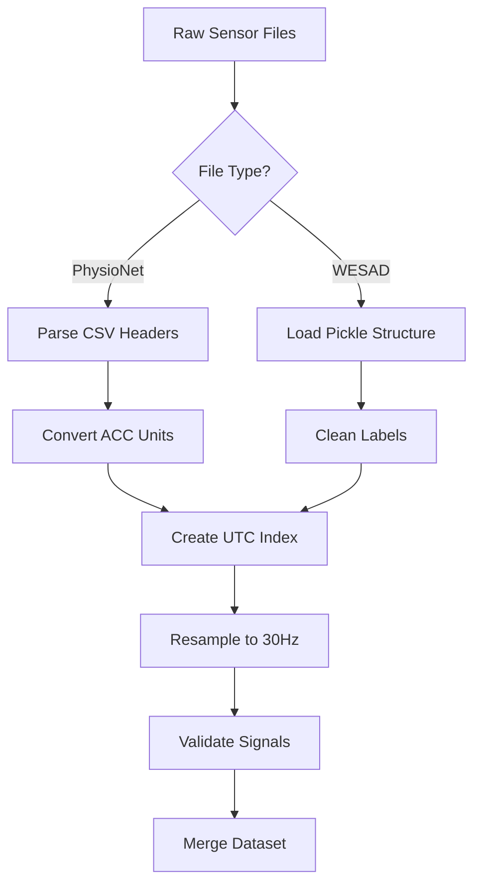

# Phase 1: Multimodal Stress Data Loading & Validation

_A robust data ingestion pipeline that unifies physiological signals from wrist-worn sensors while handling real-world dataset quirks._

---

## Introduction

This phase establishes the foundation for stress detection by solving critical challenges in:
1. **Temporal Alignment**: Synchronizing 5+ physiological signals at different sampling rates (32Hz-700Hz)
2. **Dataset Quirks**: Handling inconsistent labeling and sensor-specific formatting in PhysioNet and WESAD datasets
3. **Quality Assurance**: Automated validation of data completeness and sensor fusion integrity

---

## Problem Statement

### Background
- Raw physiological data comes with:
  - Multiple time formats (Unix timestamps vs relative timing)
  - Sensor-specific headers (ACC files with 3 values per header line)
  - Missing/invalid labels (4.0,6.0,7.0 in WESAD)
  - Variable session durations (15-90 mins)

### Objectives
1. Create unified datetime index across all sensors
2. Handle ACC sensor unit conversion (raw → g-forces)
3. Map unknown stress labels to baseline
4. Ensure ≤1% missing values post-resampling

### Scope
- Support both WESAD (Empatica E4) and PhysioNet (BioStamp) formats
- Target 30Hz unified sampling rate
- UTC timezone consistency

---

## Responsibilities

1. **Dataset Decoder Development**
   - PhysioNetLoader for BioStamp sensor CSVs
   - WESADLoader for E4 pickle files
   
2. **Temporal Fusion Engine**
   - Resampling with wearable-appropriate interpolation
   - Cross-sensor timestamp alignment

3. **Data Validation Suite**
   - Signal range checks (EDA: 0-100μS, ACC: ±2g)
   - Label distribution analysis
   - Missing data reports

---

## Phase Journey

### Understanding the Problem

**Initial Analysis Revealed:**
- ACC headers contained 3 timestamps but code expected 1
- WESAD labels had undocumented stress states
- Timezone-naive indices caused alignment failures

**Key Research:**
- BioStamp sensor specs (ACC resolution: 64LSB/g)
- E4 data format documentation
- Pandas time series resampling limitations

**Critical Insights:**
1. Sensor files contain _local_ timestamps needing UTC conversion
2. Nearest-neighbor resampling outperforms linear for ACC
3. 32Hz→30Hz requires phase-aware downsampling

### Approach & Design

**Unified Loading Architecture:**


**Key Design Decisions:**
1. **UTC Enforcement**
   ```python
   pd.date_range(..., tz='UTC').tz_convert('UTC')  # Double verification
   ```
2. **Defensive Header Parsing**
   ```python
   float(line.split(',')[0].strip())  # First value only
   ```
3. **Label Sanitization**
   ```python
   cleaned_labels = np.array([0 if l not in [0,1,2,3] else l for l in labels])
   ```

### Challenges & Lessons Learned

**Critical Roadblocks:**
1. **ACC Header Ambiguity**
   - Failure: `ValueError: could not convert string to float`
   - Solution: Protocol buffer-style parsing (first value only)

2. **Index Type Mismatch**
   - Failure: `RangeIndex` vs `DatetimeIndex` conflicts
   - Solution: Explicit index construction
   ```python
   pd.DataFrame(index=pd.DatetimeIndex(...))
   ```

3. **Label Contamination**
   - Discovery: 4% samples with invalid labels
   - Fix: Pre-DF label mapping

**Key Improvements:**
1. Added sensor-specific error contexts
   ```python
   self.logger.error(f"Sensor load failed ({file_path.name})")
   ```
2. Implemented resampling validation
   ```python
   assert abs(1/(df.index[1]-df.index[0]).total_seconds() - 30) < 0.1
   ```

---

## Architecture & Data Flow

### Core Components

1. **Data Loaders**
   - `PhysioNetLoader`: Handles nested CSV structure with session-based loading
   - `WESADLoader`: Manages pickle deserialization and label cleaning

2. **Preprocessing Pipeline**
   ```mermaid
   graph LR
       A[Raw Input] --> B[Header Extraction]
       B --> C[Unit Conversion]
       C --> D[Index Creation]
       D --> E[Resampling]
       E --> F[Quality Report]
   ```

3. **Validation Layer**
   - Signal range checks
   - Sampling rate verification
   - Label distribution analysis

### Critical Interconnections

1. **Temporal Alignment Flow**
   - BVP sensor drives master timeline (highest sampling rate)
   - Other sensors align via `merge_asof`
   - Event markers handled through time-window propagation

2. **Error Handling**
   ```python
   try:
       load_sensor() → validate() → resample()
   except SensorError:
       mark_channel_failed() → continue
   ```

---
