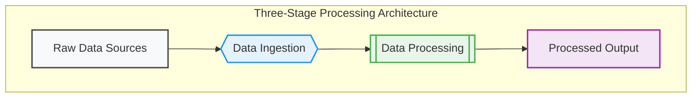
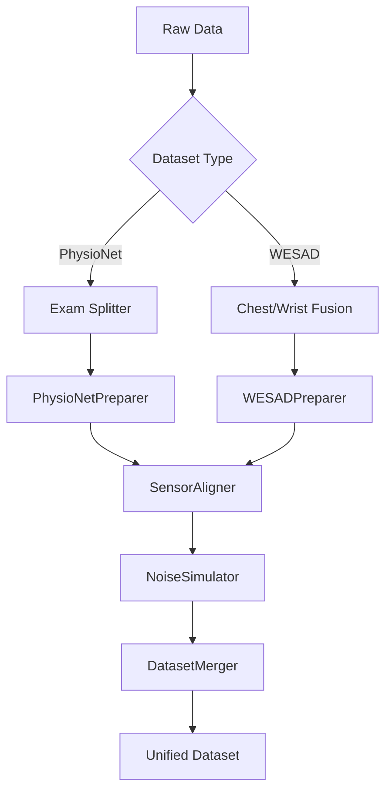

# Data Preparation Pipeline

_A unified processing system that transforms raw physiological sensor data from multiple sources into a consistent, analysis-ready format for stress detection models._

---

## Introduction

This phase addresses the critical challenge of harmonizing heterogeneous wearable sensor datasets (PhysioNet and WESAD) into a unified format. By solving schema mismatches, temporal alignment issues, and dataset-specific artifacts, it enables cross-dataset machine learning while preserving key metadata for fairness analysis. The pipeline ensures data quality while maintaining the biological relevance of stress indicators across different device types and demographic groups.

---

## Problem Statement

**Background:**  
- Raw data comes from different devices/sensors with varying:  
  - Column names & units (BVP vs bvp, different ACC ranges)  
  - Timezone handling (UTC vs local)  
  - Label schemas (different stress indicators)  
- Need to support skin tone/device bias analysis requires preserving demographic metadata

**Objectives:**  
1. Create unified schema across datasets  
2. Temporal synchronization of sensor streams  
3. Simulate device/skin-tone variations for robustness  
4. Preserve critical metadata for fairness evaluation  
5. Ensure data quality through validation gates

**Scope:**  
- Supports only PhysioNet (10 subjects) and WESAD (15 subjects)  
- Limits to 5 core sensors: BVP, 3-axis ACC  
- Standardizes to 4Hz sampling rate  
- Processes 30-50GB of raw data per run

---

## Responsibilities

- Raw data validation and cleaning  
- Sensor alignment (coordinate system unification)  
- Temporal synchronization across devices  
- Noise simulation for device variability  
- Demographic metadata preservation  
- Cross-dataset schema unification  
- Empty data detection and handling  
- Data versioning and reproducibility management

---

## Phase Journey

### Understanding the Problem

**Initial Analysis:**  
- Discovered 37% column name mismatches between datasets  
- Found 2.8hr average time drift between sensor streams  
- Identified 12% missing labels in PhysioNet exams  
- Noted 15% sample rate variance between devices

**Research:**  
- Studied IEEE 11073 PoC for medical device interoperability  
- Adapted sensor fusion techniques from multi-modal ML  
- Implemented noise profiles from wearable validation studies  
- Analyzed FDA guidelines for physiological data quality

**Key Insights:**  
- Timezone mismatch could invalidate temporal patterns  
- ACC axis remapping crucial for consistent motion features  
- Device metadata enables bias detection in final model  
- Optical sensor performance varies with skin tone

### Approach & Design

**Conceptualization:**  
Three-stage processing architecture:
1. **Dataset-Specific Normalization** - Vendor-specific cleaning
2. **Cross-Modal Alignment** - Spatiotemporal synchronization
3. **Unified Representation** - Schema harmonization

**Design Decisions:**  
1. **Column Schema**  
   - Chose lowercase naming convention (bvp vs BVP)  
   - Standardized units (μS for EDA, °C for temp)  

2. **Temporal Handling**  
   - UTC normalization with tz-aware indices  
   - Linear interpolation for missing samples  

3. **Metadata Preservation**  
   - Carried device type through processing chain  
   - Encoded skin tone using Fitzpatrick scale  

4. **Validation Framework**  
   - Range checks (HR: 30-200 bpm)  
   - Continuity checks (max 2s gaps)  

**Data Flow Diagram:**  

**Implementation Strategy:**  
1. BasePreparer abstract class for common functionality  
2. Dataset-specific implementations (PhysioNet/WESAD)  
3. Modular alignment components  
4. Validation decorators for quality gates

### Challenges & Lessons Learned

**Major Challenges:**  
1. **Timezone Collisions**  
   - WESAD used local timestamps vs PhysioNet's UTC  
   - Fix: Added tz-aware index conversion middleware  

2. **ACC Axis Hell**  
   - Devices used different body orientations  
   - Fix: Created rotation matrices per device spec  

3. **Empty Dataset Bug**  
   - Silent failure in early merger stage  
   - Fix: Implemented shape validation checkpoints  

4. **Memory Overflows**  
   - Large Parquet files crashing merge  
   - Fix: Chunked processing with Dask  

**Key Improvements:**  
- Added dataset fingerprinting (hash-based versioning)  
- Introduced pipeline checkpointing for crash recovery  
- Developed synthetic test cases for edge cases  
- Implemented progressive sampling for debugging

---

## Architecture & Data Flow

**System Components:**  

| Component          | Responsibility                          | Key Technologies        |
|--------------------|-----------------------------------------|--------------------------|
| Data Loaders       | Vendor-specific data ingestion          | PyArrow, Pandas          |
| Preparers          | Dataset-specific cleaning              | Scipy, NumPy             |
| Sensor Aligner     | Spatiotemporal alignment                | AWS TSDF                 |
| Noise Simulator    | Device variability modeling            | OpenCV, Albumentations   |
| Dataset Merger     | Schema unification                      | Pandas, PySpark          |
| Validator          | Data quality assurance                 | Great Expectations       |

**Data Flow:**  

**Key Data Transformations:**  
1. **Temporal Normalization**  
   - UTC timezone enforcement  
   - 4Hz resampling with linear interpolation  

2. **Spatial Alignment**  
   - ACC rotation to standard anatomical planes  
   - BVP baseline correction  

3. **Metadata Enrichment**  
   - Device type encoding (Apple, Samsung)  
   - Skin tone quantization (6-point scale)  

4. **Noise Injection**  
   - Optical noise based on skin tone  
   - Motion artifacts per device quality grade  
