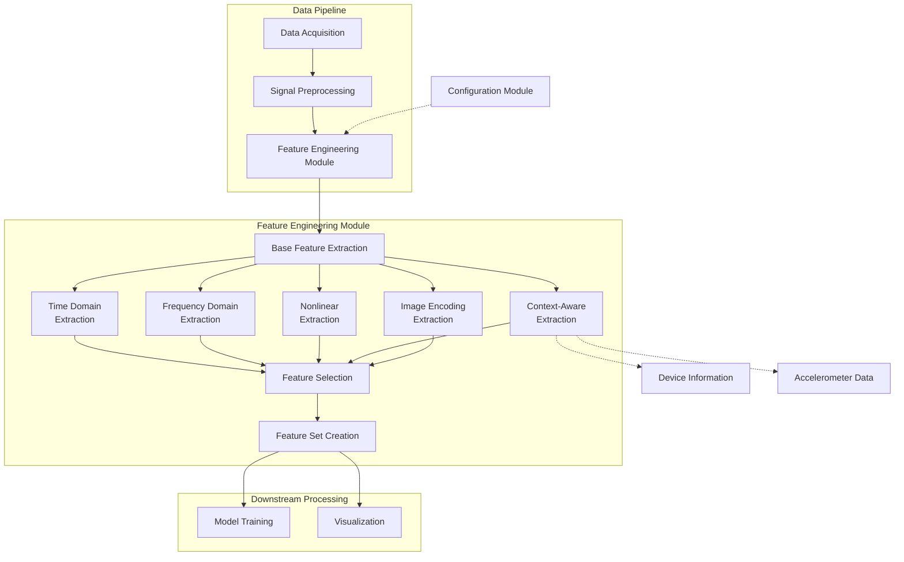

# 📊 Module: Feature Engineering

## 1. 📝 Overview
- **Purpose:**  
  The Feature Engineering module extracts, processes, and selects meaningful features from physiological sensor data to enable accurate stress detection. It transforms raw time-series signals into a rich set of features that capture various physiological patterns associated with stress responses.

- **Scope:**  
  This module addresses several key challenges in physiological signal processing:
  - 🧠 **Extraction of time-domain, frequency-domain, and non-linear features** from PPG signals
  - 🏃‍♂️ **Handling of motion artifacts and device-specific variations**
  - 🖼️ **Generation of advanced signal representations** through image encoding techniques
  - 🔑 **Feature selection** to identify the most relevant stress indicators
  - 🔄 **Creation of a consistent pipeline** for feature extraction and preprocessing

- **Key Innovations:**  
  > **Innovative techniques** to enhance feature engineering for stress detection:
  - 🤖 **Context-aware feature extraction** that integrates accelerometer data to account for motion artifacts
  - 📈 **Comprehensive non-linear feature extraction** including entropy measures and complexity metrics
  - 🖼️ **Image-based signal encoding** (GASF, MTF) to capture temporal patterns in a format suitable for deep learning
  - 🔍 **Adaptive feature selection** combining statistical, correlation-based, and model-based approaches
  - 📱 **Device-specific feature normalization** to handle variations across different wearable sensors

## 2. 🌐 Context & Integration

- **Position in Project:**  
  The Feature Engineering module serves as a bridge between data acquisition and machine learning model development in the stress detection pipeline. It takes pre-processed physiological sensor data and transforms it into feature sets that capture meaningful patterns related to stress responses. The extracted features provide the foundation for downstream machine learning models to recognize stress states.

- **Inter-Module Dependencies:**  
  - 📡 **Depends on** `data_acquisition` for obtaining raw physiological signals
  - 🔧 **Depends on** `signal_preprocessing` for receiving cleaned and filtered signals
  - 📊 **Feeds into** `model_training` with engineered feature sets
  - 📈 **Interacts with** `visualization` to provide feature importance plots and distributions
  - ⚙️ **May use** `configuration` for parameter settings across different extraction methods

## Workflow Diagram


## 3. 🏗️ Module Architecture & File Breakdown

### 📂 Directory Structure Overview:
```bash
├── feature_engineering/
│   ├── __init__.py
│   ├── base_feature_extractor.py
│   ├── time_domain_extractor.py
│   ├── frequency_domain_extractor.py
│   ├── nonlinear_extractor.py
│   ├── context_aware_extractor.py
│   ├── image_encoding_extractor.py
│   ├── feature_selector.py
│   └── feature_pipeline.py
```

### 📄 File Descriptions:
| **File**                      | **Type**      | **Responsibility**                                                                 | **Research Significance**                                                    |
|-------------------------------|---------------|-----------------------------------------------------------------------------------|-------------------------------------------------------------------------------|
| `base_feature_extractor.py`    | Core          | Defines abstract base class and common functionality for all feature extractors including windowing methods | Foundation for consistent feature extraction across different domains         |
| `time_domain_extractor.py`     | Core          | Extracts statistical and heart rate variability features in time domain           | Implements standards from Task Force (1996) for HRV analysis including SDNN, RMSSD, pNN50 |
| `frequency_domain_extractor.py`| Core          | Extracts spectral features from different frequency bands                          | Implements spectral analysis techniques aligned with Malik (1996) for VLF, LF, HF bands |
| `nonlinear_extractor.py`       | Core          | Extracts entropy measures and complexity metrics                                  | Implements entropy algorithms from Pincus (1991), Richman & Moorman (2000), and Bandt & Pompe (2002) |
| `context_aware_extractor.py`   | Core          | Extracts features that incorporate motion and device-specific context             | Extends traditional feature extraction with approach from Rashid et al. (2022) for motion artifact handling |
| `image_encoding_extractor.py`  | Core          | Creates visual encodings of signals as 2D images                                  | Implements Wang & Oates (2015) techniques for GASF and MTF encoding          |
| `feature_selector.py`          | Utility       | Provides methods for selecting most relevant features                             | Incorporates methods from Guyon & Elisseeff (2003) for feature selection     |
| `feature_pipeline.py`          | Orchestration | Coordinates overall feature extraction process and workflow                       | Combines all extractors into a comprehensive pipeline                        |

### 🔗 Inter-File Relationships:
> All feature extractor classes inherit from `BaseFeatureExtractor`, which provides the common windowing and processing functions. The `FeaturePipeline` class orchestrates the entire extraction process, utilizing the different extractor classes to generate a comprehensive feature set. The `FeatureSelector` is used within the pipeline to reduce dimensionality and identify the most relevant features for stress detection.

### 🔍 Dependency Matrix:

| **File**                      | **Internal Dependencies** | **External Dependencies**          | **Research Dependencies**                      |
|-------------------------------|---------------------------|-----------------------------------|------------------------------------------------|
| `base_feature_extractor.py`    | None                      | numpy, pandas                    | N/A                                            |
| `time_domain_extractor.py`     | base_feature_extractor     | numpy, pandas, scipy.stats, scipy.signal | Task Force (1996) - HRV Standards              |
| `frequency_domain_extractor.py`| base_feature_extractor     | numpy, pandas, scipy.fft, scipy.signal  | Malik (1996) - Frequency Domain Analysis       |
| `nonlinear_extractor.py`       | base_feature_extractor     | numpy, pandas, scipy.signal       | Pincus (1991), Richman & Moorman (2000), Bandt & Pompe (2002), Brennan et al. (2001) |
| `context_aware_extractor.py`   | base_feature_extractor     | numpy, pandas, scipy.stats        | Rashid et al. (2022) - Context-aware fusion    |
| `image_encoding_extractor.py`  | base_feature_extractor     | numpy, pandas, scipy.signal       | Wang & Oates (2015) - Imaging Time-Series      |
| `feature_selector.py`          | None                      | numpy, pandas, sklearn, matplotlib, seaborn | Guyon & Elisseeff (2003) - Feature Selection   |
| `feature_pipeline.py`          | All above files            | numpy, pandas, sklearn, matplotlib | N/A                                            |


## 4. Scientific Implementation

- 📚📝 You can find the detailed Core Algorithms & Code Snippets [here](Core_implementation.md)

## 5. Detailed Component Documentation
- 📚📝 You can find the  Detailed Component Documentation [here](Detailed_component_explanation.md)


# 🔬 6. Research-Grade Documentation

## 📝 **Key Functions** 

### ⚙️ `extract_sample_entropy(window, m=2, r=0.2)`

- **Mathematical Foundation:**  
  Sample Entropy (SampEn) quantifies the irregularity and complexity of a time series, defined as:  

  $$SampEn(m, r, N) = -\ln\frac{A^m(r)}{B^m(r)}$$  

  Where:  
  - $A^m(r)$ is the number of template vector pairs having $d[X_m(i),X_m(j)] < r$ of length $m+1$  
  - $B^m(r)$ is the number of template vector pairs having $d[X_m(i),X_m(j)] < r$ of length $m$  
  - $d[X_m(i),X_m(j)]$ is the Chebyshev distance between vectors  

  Based on Richman & Moorman (2000): "Physiological time-series analysis using approximate entropy and sample entropy."

- **Parameters & Constraints:**  
  | Parameter | Type       | Constraints/Research Justification                           |
  |-----------|------------|-------------------------------------------------------------|
  | window    | np.ndarray | Signal window, minimum length > 2m+1 samples for reliable results |
  | m         | int        | Embedding dimension, typically 2 for physiological signals per Richman & Moorman |
  | r         | float      | Tolerance threshold, typically 0.1-0.25 × SD of window; 0.2 is standard in HRV analysis |
  | **Return**| float      | Higher values indicate increased complexity/disorder associated with stress |

- **Performance Complexity:** O(N²) where N is the length of the window  

- **Validation Strategy:**  
  > Validated against reference implementations in PhysioNet toolkit and compared with clinical benchmarks on standard stress-response datasets (WESAD, SWELL)

---

### 📊 `calculate_poincare_sd(rr_intervals)`

- **Mathematical Foundation:**  
  Poincaré plot analysis maps each RR interval against the next interval. The standard deviations SD1 and SD2 are calculated as:  

  $$SD1 = \frac{1}{\sqrt{2}} \times SD(RR_{n+1} - RR_n)$$  
  $$SD2 = \sqrt{2 \times SDNN^2 - \frac{1}{2} \times SD1^2}$$  

  Where SDNN is the standard deviation of all RR intervals. Based on Brennan et al. (2001): "Do existing measures of Poincaré plot geometry reflect nonlinear features of heart rate variability?"

- **Parameters & Constraints:**  
  | Parameter    | Type             | Constraints/Research Justification                           |
  |--------------|------------------|-------------------------------------------------------------|
  | rr_intervals | np.ndarray       | Array of RR intervals in ms, minimum 2 intervals required   |
  | **Return**   | Tuple[float, float] | (SD1, SD2) where SD1 reflects parasympathetic activity and SD2 reflects both sympathetic and parasympathetic influences |

- **Performance Complexity:** O(n) where n is the number of RR intervals  

- **Validation Strategy:**  
  > Validated against reference values from the Task Force of ESC/NASPE HRV standards document and benchmarked with clinically-validated HRV analysis software (Kubios HRV)

---

### 🌊 `extract_band_powers(freqs, psd, sampling_rate=30)`

- **Mathematical Foundation:**  
  Spectral power in frequency bands is calculated using trapezoidal integration of the power spectral density:  

  $$P_{band} = \int_{f_{low}}^{f_{high}} PSD(f) \, df \approx \sum_{i} \frac{1}{2} [PSD(f_i) + PSD(f_{i+1})] \times (f_{i+1} - f_i)$$  

  For $f_i \in [f_{low}, f_{high}]$. Based on frequency bands defined in Task Force of ESC/NASPE (1996) standards for heart rate variability.

- **Parameters & Constraints:**  
  | Parameter     | Type       | Constraints/Research Justification                           |
  |---------------|------------|-------------------------------------------------------------|
  | freqs         | np.ndarray | Frequency array (Hz), should include VLF (0.0033-0.04Hz), LF (0.04-0.15Hz), and HF (0.15-0.4Hz) bands |
  | psd           | np.ndarray | Power spectral density values corresponding to freqs        |
  | sampling_rate | int        | Sampling rate in Hz, minimum 2× highest frequency of interest (Nyquist criterion) |
  | **Return**    | Dict[str, float] | Band powers and ratios; LF/HF ratio is particularly relevant as a stress biomarker |

- **Performance Complexity:** O(n) where n is the length of the frequency array  

- **Validation Strategy:**  
  > Validated against spectral analysis standards from Task Force (1996) and cross-validated with frequency-domain results from clinical-grade HRV analysis software

---

### 🖼️ `generate_gasf(window, image_size=24)`

- **Mathematical Foundation:**  
  The Gramian Angular Summation Field (GASF) represents time series in polar coordinates, encoding temporal correlations as:  

  $$GASF_{i,j} = \cos(\phi_i + \phi_j)$$  

  Where $\phi_i = \arccos(x_i')$ and $x_i'$ is the normalized time series in range [-1,1]. Based on Wang & Oates (2015): "Encoding Time-Series to Images for Visual Inspection and Classification Using Tiled Convolutional Neural Networks."

- **Parameters & Constraints:**  
  | Parameter  | Type       | Constraints/Research Justification                           |
  |------------|------------|-------------------------------------------------------------|
  | window     | np.ndarray | Signal window; ideally stationary over the window period    |
  | image_size | int        | Size of resulting matrix; 24×24 balances information retention with computational efficiency |
  | **Return** | np.ndarray | 2D GASF matrix with values in [-1,1]; diagonal preserves original signal shape |

- **Performance Complexity:** O(n²) where n is the image_size  

- **Validation Strategy:**  
  > Performance evaluated through comparison with traditional feature extraction in stress classification tasks on standard datasets (WESAD); visualized using t-SNE to verify stress vs. non-stress state separation

---

### 🏃 `calculate_motion_artifact_correlation(ppg, acc_mag)`

- **Mathematical Foundation:**  
  Motion artifact probability is estimated using the absolute Pearson correlation coefficient between PPG and accelerometer signals:  

  $$r_{PPG,ACC} = \frac{\sum_{i=1}^{n}(PPG_i - \overline{PPG})(ACC_i - \overline{ACC})}{\sqrt{\sum_{i=1}^{n}(PPG_i - \overline{PPG})^2 \sum_{i=1}^{n}(ACC_i - \overline{ACC})^2}}$$  
  $$P_{artifact} = |r_{PPG,ACC}|$$  

  Based on Rashid et al. (2022) approach for context-aware physiological signal processing.

- **Parameters & Constraints:**  
  | Parameter | Type       | Constraints/Research Justification                           |
  |-----------|------------|-------------------------------------------------------------|
  | ppg       | np.ndarray | PPG signal window, same length and time alignment as acc_mag |
  | acc_mag   | np.ndarray | Acceleration magnitude, calculated as √(acc_x² + acc_y² + acc_z²) |
  | **Return**| Dict[str, float] | Correlation metrics and quality assessment; higher correlation indicates motion artifacts |

- **Performance Complexity:** O(n) where n is the length of the signals  

- **Validation Strategy:**  
  > Validated by comparing feature extraction results with and without motion correction on physical activity datasets; improvement in stress classification accuracy with motion correction confirms efficacy

---

### 🔄 `calculate_dfa(window, scales)`

- **Mathematical Foundation:**  
  Detrended Fluctuation Analysis (DFA) quantifies the scaling exponent α of fractal correlations in a time series by:  

  1. Integrate the signal: $y(k) = \sum_{i=1}^{k} [x(i) - \bar{x}]$  
  2. Divide into boxes of length n  
  3. Calculate local trend $y_n(k)$ in each box using linear fit  
  4. Calculate fluctuation: $F(n) = \sqrt{\frac{1}{N} \sum_{k=1}^{N} [y(k) - y_n(k)]^2}$  
  5. Determine scaling exponent α from log-log plot of $F(n)$ vs. $n$: $F(n) \propto n^α$  

  Based on Peng et al. (1995): "Quantification of scaling exponents and crossover phenomena in nonstationary heartbeat time series."

- **Parameters & Constraints:**  
  | Parameter | Type       | Constraints/Research Justification                           |
  |-----------|------------|-------------------------------------------------------------|
  | window    | np.ndarray | Signal window; length should be at least 4× largest scale   |
  | scales    | np.ndarray | Array of box sizes; short-term (4-16) and long-term (16-64) commonly used in HRV |
  | **Return**| float      | α scaling exponent; α₁~1.0 indicates healthy state, deviations associate with stress |

- **Performance Complexity:** O(N log N) where N is the length of the window  

- **Validation Strategy:**  
  > Validated against reference implementations and benchmarked with clinical α values from published studies on autonomic regulation during stress
