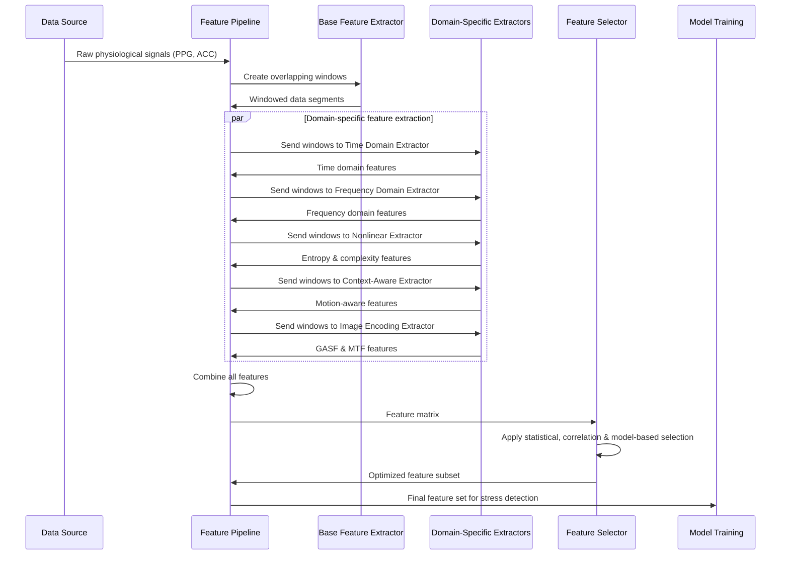

## 4. 🧑‍🔬 Scientific Implementation

### 🔑 Core Algorithms & Code Snippets

#### 1. **Sample Entropy Extraction**
```python
def extract_sample_entropy(window, m=2, r=0.2):
    """
    Calculates Sample Entropy to quantify the unpredictability of physiological signals.
    
    Sample Entropy measures complexity by calculating the negative natural logarithm
    of the conditional probability that subseries of length m+1 match given that
    subseries of length m match. Based on Richman & Moorman (2000).
    
    Parameters:
        window (np.ndarray): Signal window to analyze
        m (int): Embedding dimension (default: 2 as per physiological standards)
        r (float): Tolerance threshold, typically 0.2*std of the window

    Returns:
        float: Sample Entropy value (higher values indicate more complexity/stress)
    """
    # Ensure window has enough points
    if len(window) < 2 * m + 1:
        return 0
    
    # Calculate actual tolerance (r*std of the signal)
    tolerance = r * np.std(window)
    
    # Create embedded vectors of length m and m+1
    def _create_vectors(data, dim):
        vectors = []
        for i in range(len(data) - dim + 1):
            vectors.append(data[i:i+dim])
        return np.array(vectors)
    
    # Count matches (vectors within tolerance)
    def _count_matches(vectors, tolerance):
        N = len(vectors)
        B = 0.0
        for i in range(N-1):
            for j in range(i+1, N):
                if np.max(np.abs(vectors[i] - vectors[j])) < tolerance:
                    B += 2.0  # Count each match twice (i,j) and (j,i)
        return B / (N * (N-1))
    
    # Calculate for m and m+1
    vectors_m = _create_vectors(window, m)
    vectors_m1 = _create_vectors(window, m+1)
    
    count_m = _count_matches(vectors_m, tolerance)
    count_m1 = _count_matches(vectors_m1, tolerance)
    
    # Calculate sample entropy
    if count_m > 0 and count_m1 > 0:
        return -np.log(count_m1 / count_m)
    else:
        return 0
```

#### 2. **Gramian Angular Summation Field (GASF) Encoding**
```python
def generate_gasf(window, image_size=24):
    """
    Generate Gramian Angular Summation Field (GASF) encoding of time series data.
    
    This encoding represents time series in polar coordinates, capturing temporal 
    correlations in an image format suitable for deep learning algorithms.
    Based on Wang & Oates (2015).
    
    Parameters:
        window (np.ndarray): Signal window to encode
        image_size (int): Size of resulting GASF matrix (default: 24x24)

    Returns:
        np.ndarray: 2D GASF matrix representation of the signal
    """
    # Resample window to target size
    if len(window) < image_size:
        resampled = np.pad(window, (0, image_size - len(window)), 'constant')
    else:
        indices = np.floor(np.linspace(0, len(window) - 1, image_size)).astype(int)
        resampled = window[indices]
    
    # Normalize to [-1, 1] range (required for polar encoding)
    min_val, max_val = np.min(resampled), np.max(resampled)
    if max_val == min_val:
        normalized = np.zeros_like(resampled)
    else:
        normalized = 2 * ((resampled - min_val) / (max_val - min_val)) - 1
    
    # Convert to polar coordinates (angle dimension)
    phi = np.arccos(normalized)
    
    # Calculate GASF matrix
    gasf = np.zeros((image_size, image_size))
    for i in range(image_size):
        for j in range(image_size):
            # Summation encoding: cos(φi + φj)
            gasf[i, j] = np.cos(phi[i] + phi[j])
    
    return gasf
```

#### 3. **Frequency Band Power Extraction**
```python
def extract_band_powers(freqs, psd, sampling_rate=30):
    """
    Extract power in different frequency bands from the power spectral density.
    
    This follows the frequency band definitions from the Task Force (1996) paper,
    modified for PPG analysis with focus on stress-relevant frequency bands.
    
    Parameters:
        freqs (np.ndarray): Frequency array from spectrum analysis
        psd (np.ndarray): Power spectral density values
        sampling_rate (int): Sampling rate in Hz (default: 30Hz)

    Returns:
        dict: Dictionary containing power values in VLF, LF, HF bands and ratios
    """
    features = {}
    
    # Define frequency bands (in Hz)
    vlf_band = (0.0033, 0.04)  # Very Low Frequency
    lf_band = (0.04, 0.15)     # Low Frequency 
    hf_band = (0.15, 0.4)      # High Frequency
    
    # Calculate absolute power in each band using trapezoidal integration
    def _band_power(freqs, psd, freq_band):
        low, high = freq_band
        mask = (freqs >= low) & (freqs <= high)
        if not np.any(mask):
            return 0
        return np.trapz(psd[mask], freqs[mask])
    
    vlf_power = _band_power(freqs, psd, vlf_band)
    lf_power = _band_power(freqs, psd, lf_band)
    hf_power = _band_power(freqs, psd, hf_band)
    
    # Total power (excluding VLF for short-term recordings as per standards)
    total_power = lf_power + hf_power
    
    # Store absolute powers
    features['vlf_power'] = vlf_power
    features['lf_power'] = lf_power
    features['hf_power'] = hf_power
    features['total_power'] = total_power
    
    # Calculate normalized powers
    if total_power > 0:
        features['lf_power_norm'] = (lf_power / total_power) * 100
        features['hf_power_norm'] = (hf_power / total_power) * 100
    else:
        features['lf_power_norm'] = 0
        features['hf_power_norm'] = 0
    
    # Calculate LF/HF ratio (key stress indicator)
    features['lf_hf_ratio'] = lf_power / hf_power if hf_power > 0 else 0
    
    return features
```

#### 4. **Motion Artifact Correlation Calculation**
```python
def calculate_motion_artifact_correlation(ppg, acc_mag):
    """
    Calculate correlation between PPG and accelerometer data to estimate motion artifacts.
    
    This approach is based on the context-aware fusion technique from Rashid et al. (2022)
    which uses motion correlation to estimate signal quality and artifact probability.
    
    Parameters:
        ppg (np.ndarray): PPG signal window
        acc_mag (np.ndarray): Magnitude of acceleration from 3-axis accelerometer

    Returns:
        dict: Dictionary containing correlation metrics and artifact probability
    """
    features = {}
    
    # Ensure arrays have the same length
    min_length = min(len(ppg), len(acc_mag))
    ppg = ppg[:min_length]
    acc_mag = acc_mag[:min_length]
    
    # Calculate Pearson correlation
    corr, p_value = stats.pearsonr(ppg, acc_mag)
    
    features['ppg_acc_mag_corr'] = corr
    features['ppg_acc_mag_corr_p'] = p_value
    
    # Motion artifact probability estimation (higher correlation indicates more artifacts)
    features['motion_artifact_prob'] = np.abs(corr)
    
    # Signal quality estimation (inverse of motion artifact probability)
    features['signal_quality'] = 1.0 - features['motion_artifact_prob']
    
    return features
```

### 🏗️ Data Flow Pipeline



