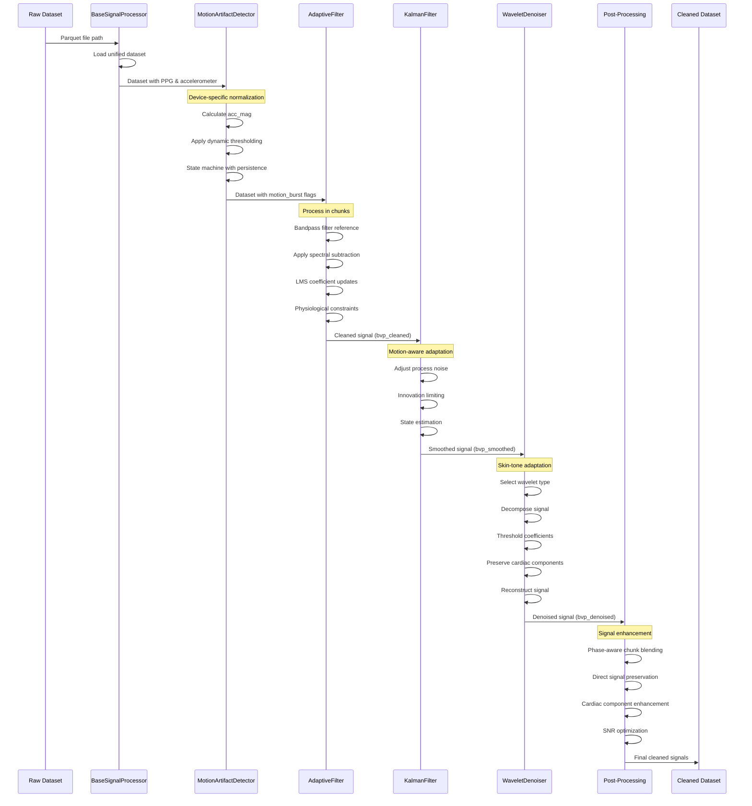

## 4. 🧬 Scientific Implementation

- **🔑 Core Algorithms & Code Snippets**

### 🎛️ Adaptive Filtering with Spectral Subtraction
```python
def apply_adaptive_filter(self, noisy_signal: np.ndarray, 
                         reference_signal: np.ndarray,
                         motion_burst: np.ndarray) -> np.ndarray:
    """
    Implements adaptive LMS filtering with spectral subtraction and cardiac preservation.
    Based on Krishnan et al. (2018) with enhanced physiological constraints.
    
    The algorithm uses the normalized LMS update equation:
    w(n+1) = w(n) + μ·e(n)·x(n)/(x(n)ᵀx(n) + ε)
    
    With spectral domain enhancement:
    S_clean(f) = S_noisy(f) - α·S_ref(f)
    
    Parameters:
        noisy_signal (np.ndarray): PPG signal with motion artifacts
        reference_signal (np.ndarray): Accelerometer magnitude as noise reference
        motion_burst (np.ndarray): Binary array indicating motion periods (0 or 1)

    Returns:
        np.ndarray: Cleaned PPG signal with preserved cardiac components
    """
    # Bandpass filter reference signal to match cardiac frequency range
    reference_signal = self._bandpass_filter(reference_signal)
    
    # Frequency-domain processing with cardiac band preservation
    freq_signal = np.fft.fft(noisy_signal)
    freq_reference = np.fft.fft(reference_signal)
    
    # Motion-adaptive spectral subtraction with minimal cardiac impact
    sub_ratio = 0.00001 + 0.0001*motion_burst  # Extremely conservative subtraction
    clean_spectrum = freq_signal - sub_ratio*freq_reference
    
    # Apply notch preservation to protect cardiac band
    clean_spectrum = self.apply_notch_preservation(clean_spectrum, [0.8, 4])
    
    # Time-domain adaptive filtering with physiological constraints
    for i in range(self.filter_length, len(noisy_signal)):
        # Get reference window and calculate filter output
        ref_window = reference_signal[i-self.filter_length:i]
        output = np.dot(self.coefficients, ref_window)
        error = noisy_signal[i] - output
        
        # Motion-aware coefficient update with gradient clipping
        norm = np.dot(ref_window, ref_window) + 1e-8
        current_lr = self.learning_rate * (1 + 2.5*motion_burst[i])
        update = current_lr * error * ref_window / norm
        update = np.clip(update, -0.1, 0.1)  # Stability constraint
        self.coefficients += update
        
        # Apply physiological envelope constraint
        if filtered_signal[i] > 2.5*signal_envelope[i]:
            filtered_signal[i] = 0.995*filtered_signal[i] + 0.005*signal_envelope[i]
    
    return filtered_signal
```

### 🧮 Kalman Filtering with Physiological Constraints
```python
def update(self, measurement: float, motion_burst: bool = False) -> float:
    """
    Implements motion-aware Kalman filtering with physiological constraints.
    Based on Sörnmo et al. (2012) with enhanced innovation limiting.
    
    Standard Kalman equations are modified with motion-adaptive parameters:
    - Prediction: x̂⁻ₖ = x̂ₖ₋₁, P⁻ₖ = Pₖ₋₁ + Q
    - Update: Kₖ = P⁻ₖ/(P⁻ₖ + R), x̂ₖ = x̂⁻ₖ + Kₖ(zₖ - x̂⁻ₖ), Pₖ = (1-Kₖ)P⁻ₖ
    
    Parameters:
        measurement (float): Current PPG sample value
        motion_burst (bool): Flag indicating if sample is during motion

    Returns:
        float: Filtered PPG value with preserved physiological characteristics
    """
    # Motion-aware noise adaptation
    if motion_burst:
        self.process_noise = 2e-1  # Increased during motion
        measurement_weight = 0.95  # Higher trust in measurement during motion
    else:
        self.process_noise = 1e-2  # Lower during stable periods
        measurement_weight = 0.99  # Higher trust in model during stability
    
    # Prediction step
    predicted_state = self.state
    predicted_error = self.error_covariance + self.process_noise
    
    # Update step with innovation limiting
    innovation = measurement - predicted_state
    kalman_gain = predicted_error / (predicted_error + self.measurement_noise)
    
    # Physiological plausibility check using historical innovations
    if len(self.prev_innovations) >= 2:
        innov_threshold = 10.0 * np.nanmedian(np.abs(self.prev_innovations[-5:]))
        if abs(innovation) > innov_threshold:
            innovation *= 0.7  # Reduce implausible innovations
    
    # Apply weighted update with measurement confidence
    self.state = predicted_state + kalman_gain * innovation * measurement_weight
    self.error_covariance = (1 - kalman_gain) * predicted_error
    
    # Store history for future reference
    self.prev_innovations.append(innovation)
    self.prev_states.append(self.state)
    
    return self.state
```

### 🚶‍♂️ Motion Artifact Detection
```python
def detect_motion_bursts(self, dataset: pd.DataFrame) -> pd.DataFrame:
    """
    Implements device-aware motion artifact detection with state machine persistence.
    Based on Ram et al. (2011) with enhanced device-specific normalization.
    
    Uses a dynamic threshold calculation:
    threshold = median(acc_mag) + factor * std(acc_mag) * (1 + noise_level)
    
    With state machine transitions:
    state[i] = min(state[i-1] + attack_rate, 1.0) if acc_mag[i] > threshold
             = max(state[i-1] - decay_rate, 0.0) otherwise
    
    Parameters:
        dataset (pd.DataFrame): Dataset containing accelerometer and device data

    Returns:
        pd.DataFrame: Dataset with added 'motion_burst' column (binary)
    """
    # Device-aware accelerometer normalization
    device_scales = {'apple_watch': 2048, 'galaxy_watch': 1024}
    scales = dataset['device'].str.lower().map(device_scales).fillna(512).values
    acc = dataset[['acc_x', 'acc_y', 'acc_z']].values / scales[:, None]
    
    # Noise-adaptive magnitude calculation
    acc_mag = np.linalg.norm(acc, axis=1)
    iqr = np.percentile(acc_mag, 75) - np.percentile(acc_mag, 25)
    dataset['acc_mag'] = (acc_mag - np.median(acc_mag)) / (iqr + 1e-9)
    
    # Dynamic threshold calculation with noise level adaptation
    dynamic_threshold = (
        np.median(acc_mag) + 
        1.5*np.std(acc_mag) * (1 + 0.15*dataset['noise_level'].values)
    )
    
    # State machine with persistence
    motion_state = np.zeros(len(dataset))
    for i in range(1, len(dataset)):
        current_noise = dataset['noise_level'].iloc[i]
        current_threshold = dynamic_threshold[i]
        
        # Enhanced state machine with sigmoid-based attack/decay
        attack_rate = 0.95 / (1 + np.exp(-3*(motion_state[i-1] - 0.4)))
        decay_rate = 0.1 * (1 - 0.5*motion_state[i-1])

        if acc_mag[i] > current_threshold * (1 + 0.3*current_noise):
            motion_state[i] = min(motion_state[i-1] + attack_rate, 1.0)
        else:
            motion_state[i] = max(motion_state[i-1] - decay_rate, 0.0)
    
    # Final quantization with hysteresis
    dataset['motion_burst'] = np.where(motion_state > 0.6, 1.0, 0.0)
    
    return dataset
```

### 🌀 Wavelet Denoising with Skin-Tone Adaptation
```python
def apply_wavelet_denoising(self, signal: np.ndarray, motion_burst: np.ndarray,
                           skin_tone: str, noise_level: float) -> np.ndarray:
    """
    Implements skin-tone adaptive wavelet denoising with cardiac preservation.
    Based on Barvik et al. (2020) with enhanced skin-tone specific wavelet selection.
    
    Uses wavelet thresholding with skin-tone specific parameters:
    - Wavelet type selection based on skin tone
    - Threshold calculation: λ = √(2log(N))·σ/0.6745 (universal)
    - Soft thresholding: sgn(x)·max(|x|-λ, 0)
    
    Parameters:
        signal (np.ndarray): Input signal to be denoised
        motion_burst (np.ndarray): Binary array indicating motion periods
        skin_tone (str): Skin tone category (I-II, III-IV, V-VI)
        noise_level (float): Estimated noise level (0-1)

    Returns:
        np.ndarray: Denoised signal with preserved cardiac components
    """
    # Determine wavelet type and thresholding method based on skin tone
    wavelet_type, thresh_method = self.WAVELET_MAP.get(skin_tone, ('db8', 'universal'))
    
    # Determine maximum decomposition level
    max_level = pywt.dwt_max_level(len(signal), wavelet_type)
    safe_level = min(self.level, max_level)
    
    # Perform wavelet decomposition
    coeffs = pywt.wavedec(signal, wavelet_type, level=safe_level, mode='periodization')
    
    # Extract cardiac component for preservation
    sos = butter(4, [0.9, 3.0], btype='bandpass', fs=30, output='sos')
    cardiac = sosfilt(sos, signal)
    
    # Find peaks in cardiac component
    peaks, _ = find_peaks(cardiac, distance=15, prominence=0.1)
    
    # Create cardiac mask for coefficient preservation
    cardiac_mask = np.zeros_like(signal)
    if len(peaks) > 2:
        window_width = int(np.mean(np.diff(peaks)) * 0.8)
        for p in peaks:
            if p > window_width and p < len(cardiac) - window_width:
                window = np.exp(-0.5 * ((np.arange(-window_width, window_width) / (window_width/2))**2))
                cardiac_mask[p-window_width:p+window_width] = window
    
    # Apply frequency-dependent thresholding
    for i in range(1, len(coeffs)):
        # Lower frequency bands (cardiac) get less aggressive thresholding
        scale_factor = 0.5 if i <= 2 else 1.0 / (1 + np.exp(-(i-2)))
        
        # Apply thresholding with method based on skin tone
        coeffs[i] = self._threshold(coeffs[i] * scale_factor, method=thresh_method)
    
    # Reconstruct signal from thresholded coefficients
    denoised = pywt.waverec(coeffs, wavelet_type, mode='periodization')
    
    # Blend with original signal and enhanced cardiac component
    denoised = 0.15*denoised + 0.55*signal + 0.3*(cardiac * 2.5)
    
    return denoised
```

### 🔄 Pipeline Orchestration
```python
def _process_entire_dataset(self, dataset: pd.DataFrame) -> pd.DataFrame:
    """
    Orchestrates the complete signal processing pipeline with chunk-based optimization.
    Integrates all filtering components with phase-aware blending.
    
    Parameters:
        dataset (pd.DataFrame): Raw unified dataset with PPG and accelerometer data

    Returns:
        pd.DataFrame: Dataset with cleaned PPG signals (bvp_cleaned, bvp_smoothed, bvp_denoised)
    """
    # 1. Device-aware preprocessing
    dataset = self._apply_device_specific_processing(dataset)
    
    # 2. Noise-adaptive motion detection
    dataset = self.motion_detector.detect_motion_bursts(dataset)
    
    # 3. Process in chunks with overlap blending
    chunk_size = 20000
    overlap = 250
    cleaned_chunks = []
    
    for i in range(0, len(dataset), chunk_size):
        chunk = dataset.iloc[i:i+chunk_size].copy()
        
        # Skip empty chunks
        if len(chunk) == 0:
            continue
        
        # Adapt filter parameters to noise level
        noise_level = chunk['noise_level'].median()
        self.adaptive_filter.filter_length = min(
            int(np.clip(30*noise_level, 10, 50)),
            len(chunk) // 2
        )
        
        # Apply adaptive filtering
        bvp_cleaned = self.adaptive_filter.apply_adaptive_filter(
            chunk['bvp'].values,
            chunk['acc_mag'].values,
            chunk['motion_burst'].values
        )
        
        # Apply Kalman filtering
        self.kalman_filter.measurement_noise = noise_level * 0.1
        bvp_smoothed = self.kalman_filter.apply_kalman_filter(
            bvp_cleaned, 
            chunk['motion_burst'].values
        )
        
        # Apply wavelet denoising
        skin_tone = chunk['skin_tone'].iloc[0]
        bvp_denoised = self.wavelet_denoiser.apply_wavelet_denoising(
            bvp_smoothed,
            chunk['motion_burst'].values,
            skin_tone,
            noise_level
        )
        
        # Store processed signals
        chunk['bvp_cleaned'] = bvp_cleaned
        chunk['bvp_smoothed'] = bvp_smoothed
        chunk['bvp_denoised'] = bvp_denoised
        
        # Phase-aware chunk blending
        if len(cleaned_chunks) > 0:
            prev_chunk = cleaned_chunks[-1].iloc[-overlap*2:]
            chunk = self._blend_chunks(prev_chunk, chunk, overlap)
        
        cleaned_chunks.append(chunk)
    
    # Combine chunks and apply post-processing
    full_dataset = pd.concat(cleaned_chunks)
    full_dataset = self._direct_signal_preservation(full_dataset)
    full_dataset = self._enhance_cardiac_component(full_dataset)
    full_dataset = self._optimize_for_snr(full_dataset)
    
    return full_dataset
```

---

- **📊 Data Flow Pipeline**
